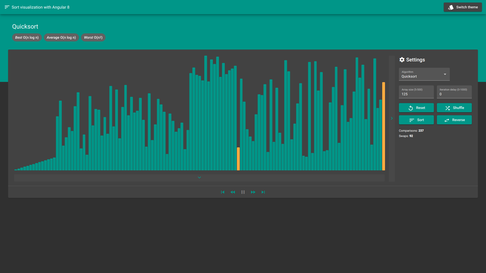

# Sort visualization

Sort visualization application inspired by [this video](https://www.youtube.com/watch?v=kPRA0W1kECg). The main purpose of the app is to show sort algorithms step by step, their differences and similarities in a handy UI.

## Development server

Run `$ yarn start` for a dev server. Navigate to `http://localhost:4200/`. The app will automatically reload if you change any of the source files.

## Build

Run `$ yarn build` to build the project. The build artifacts will be stored in the `dist/` directory.

## Supported algorithms

- Bubble Sort
- Cocktail Sort
- Insertion Sort
- Merge Sort
- Quick Sort
- Selection Sort
